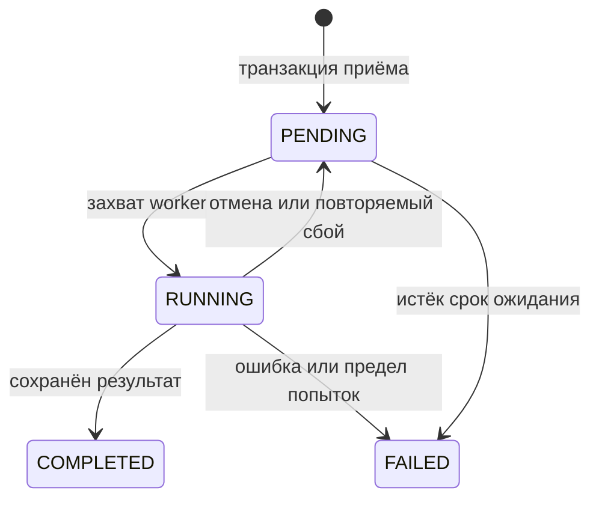

# Архитектура Documentor

## Границы модулей

| Модуль | Ответственность |
|---|---|
| `bot/handlers`, `api/routes` | Транспорт, авторизация владельца, представление |
| `services/checks.py` | Приём задания, атомарная квота, снимок требований |
| `services/dispatch.py` | Передача ID задач из БД в Redis, восстановление статусов |
| `worker.py` | Захват задания, анализ, независимая доставка |
| `analysis/pipeline.py` | Последовательность разбора, правил, AI и агрегации |
| `document/effective.py` | Наследование стилей и эффективное форматирование OOXML |
| `document/parser.py` | Модель документа с таблицами и всеми секциями |
| `rules` | Детерминированные проверки по снимку пресета |
| `ai` | Провайдер, обязательные схемы, бюджет и покрытие |
| `reports` | Telegram-текст и атомарное создание PDF |
| `database` | ORM, репозитории, сессии и миграции |
| `services/retention.py` | Очистка исходников, PDF и результатов |

Зависимости направлены от транспортов к сервисам и предметным модулям. API не вызывает Telegram-обработчики; история использует общий сервис восстановления результата.

## Транзакции и очередь

Приём записывает Document, Check, job_payload и preset_snapshot одной транзакцией. Перед подсчётом квоты выполняется запись в строку пользователя: PostgreSQL блокирует строку, SQLite сериализует записи. Квота и создание Check выполняются под этой блокировкой.

Check служит transactional outbox. Dispatcher выбирает PENDING и COMPLETED с ожидающей доставкой. Redis ID `check:{id}` предотвращает дублирование задания в очереди; worker дополнительно захватывает запись условным UPDATE по ожидаемому статусу.

Доставка имеет отдельное поле: `pending → sending → sent`; сбой возвращает pending, исчерпание попыток даёт failed. Анализ при этом остаётся COMPLETED. Повтор использует снимки результата и пресета, без исходного документа и новых LLM-запросов.

Старые RUNNING/sending восстанавливаются после `JOB_TIMEOUT_SECONDS + 60`. Число попыток ограничено.

Гарантия внешней доставки не является exactly-once. Если Telegram принял сообщение, а процесс завершился до записи sent, повтор может продублировать сообщение. Дедупликация очереди не устраняет эту неопределённость внешнего сервиса.

## Снимки и совместимость

result_snapshot сохраняет CheckResult целиком: категории, знаменатель оценки, цитаты, структуру и покрытие AI. findings остаются для запросов и старого API. Повторное сохранение заменяет прежние findings, а не добавляет копии.

Старые записи без снимка показывают сохранённый общий балл и замечания. Категории не пересчитываются по новому YAML. Нулевой балл сохраняется.

Миграции добавляют поля без удаления результатов. Старые незавершённые задания без payload помечаются FAILED. Для SQLite с legacy create_all проверяется известный состав схемы перед Alembic stamp; неизвестная схема отклоняется. Перед миграциями нужен backup.

## AI и оценка

Grammar/style/content обрабатываются независимо: успешные замечания не теряются при сбое другого запроса. Введение использует отдельную обязательную схему. Покрытие — доля успешно выполненных запланированных запросов, а не гарантия семантической точности.

SDK retries отключены. Перед каждой попыткой резервируются вход, служебный текст и лимит ответа. Неизвестный usage сохраняет резерв; известный возвращает излишек. Введение, не помещающееся в бюджет, не отправляется. Mock не создаёт findings и не оценивает AI-категории.

При неполном анализе AI-категории исключаются из числового итога; частичные замечания доступны отдельно. Параллелизм ограничен числом задач worker; внутри документа запросы последовательные.

## Безопасность и данные

Результат доступен только владельцу. Роль определяется актуальными ADMIN_IDS и не даёт неявного доступа к чужим документам. API использует явно выданные ключи, по умолчанию доступ закрыт.

До скачивания проверяются расширение, MIME и заявленный размер; буфер ограничивает фактический размер. До распаковки проверяются объём частей, сумма, число элементов и коэффициент сжатия. DTD запрещён. Проверка и разбор вынесены из event loop.

Исходник удаляется после фиксации результата; отмена его сохраняет. Очистка защищает PENDING/RUNNING. Отчёты и результаты имеют независимые сроки хранения. PDF публикуется заменой временного файла после успешного построения.

Полная вёрстка Word не воспроизводится: страницы приблизительные, сложная нумерация и библиография ограничены, формат таблиц отдельно не оценивается. Эти ограничения отражены в README.
